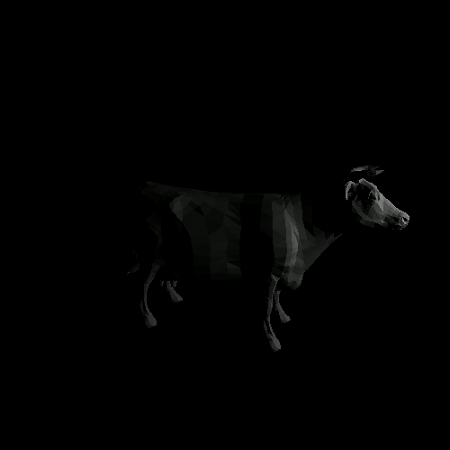

# vymir - вимір (Ukrainian for 'dimension')

A simple renderer for .obj files in pure Java.

For rendering we use a Z-buffer and backface culling:

     

Rendering the [animation](doc/test.gif) shown above took about 10ms per frame - at least on my machine...

In [halloween.gif](doc/halloween.gif), [this .obj](https://www.turbosquid.com/3d-models/free-halloween-pumpkin-3d-model/961113) was used.
